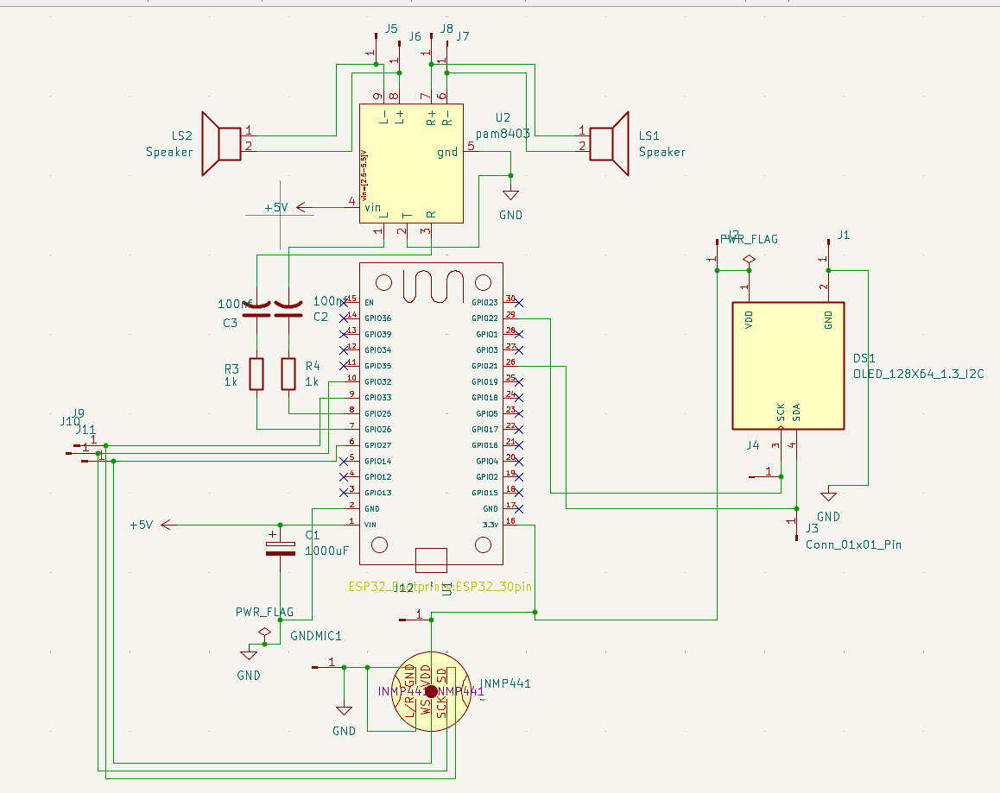
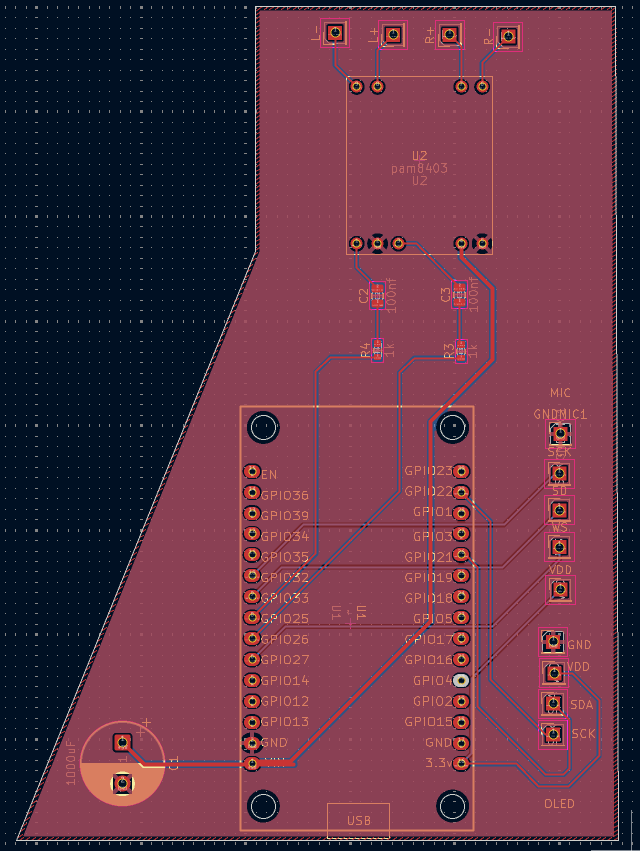
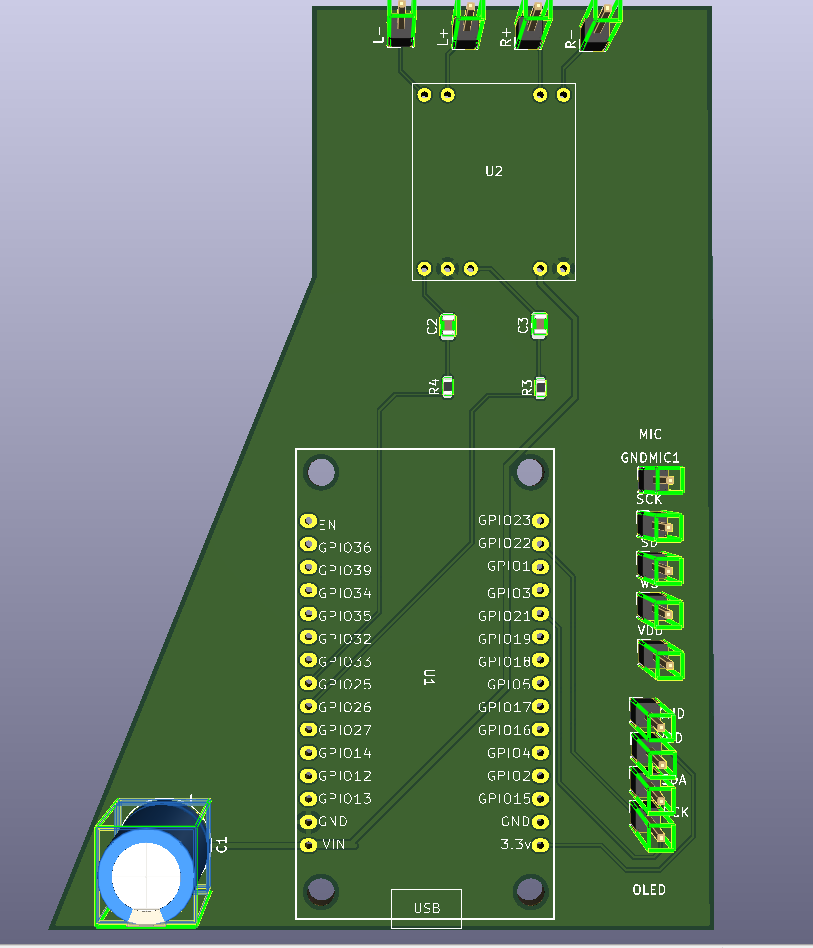

# Asistente Inteligente IA con ESP32 🤖

Un asistente de voz autónomo basado en hardware ESP32 que utiliza la potencia de la nube (Flask + Groq) para mantener conversaciones fluidas. "Luna" es capaz de escuchar tus peticiones, procesar transcripciones ultrarrápidas, generar inteligencia conversacional con Llama-3.1 y responder con voz de forma directa por sus altavoces, a la vez que muestra animaciones en su pantalla OLED interactiva.

---

## Características Principales

1. **Interacción Dual**:
   - **Wake Word ("Luna")**: Escucha continua optimizada. Puedes llamarla por su nombre, el ESP32 transmite al backend para confirmar la detección y despierta de inmediato.
   - **Botón Físico**: Interacción clásica manteniendo presionado un pulsador (Pin 14) para dictar o grabar peticiones manualmente.
2. **Sistema VAD (Voice Activity Detection)**:
   - Implementado nativamente en MicroPython local. La grabación para la detección de la palabra de activación se dispara solo si la amplitud del micrófono supera un umbral dinámico (se evitan grabaciones en silencio), ahorrando batería y ancho de banda al servidor.
3. **Gestión de Red y Memoria Avanzada**:
   - **Sockets HTTP Manuales y Chunking**: Para evitar los severos límites de RAM en MicroPython al enviar archivos pesados (WAVs completos), el cliente usa sockets HTTP puros y _chunking_ (envío múltiple fragmentado del búfer).
   - **Auto-Estabilización WiFi**: El controlador de red local cuenta con reinicio lógico forzoso, sorteando con solidez los conocidos bloqueos de conexión fantasma en los ESP32.
4. **Reproducción Estabilizada por Hardware DAC**:
   - **Audio Puro**: El backend construye respuestas TTS de pydub a formato PCM 8000Hz Mono, de 8-bits unsigned. Formato nativo para el DAC del ESP32 (Pines 25 y 26).
   - **Compensación de Latencia**: El bucle de lectura/escritura en MicroPython tiene retrasos medidos y deducidos del Sample Rate original usando compensación en microsegundos, asegurando máxima sincronía y evitando saltos de audio.
5. **Interfaz Visual Viva (Pantalla SH1106)**:
   - Pantalla interactiva que reacciona según cada fase del pipeline (dormido/Zzzz, sorprendido al escuchar, cargando mientras procesa la red, hablando al transcribir, u ojos tristes si surge algún fallo).
   - Reloj local mantenido en segundo plano gracias a sincronización remota por NTP (Network Time Protocol).
6. **Backend Potenciado por IA de Groq**:
   - `/transcribir` y `/despertar` delegan el audio recogido hacia **Whisper Large V3 Turbo** de Groq.
   - `/preguntar` redirige el texto al modelo **Llama-3.1-8B-Instant**, incorporando el archivo `historial.json` para gestionar un contexto temporal configurable.
   - "Miguel" es el pre-prompt. Una personalidad de universitario, 20 años que es amable y precisa.

---

## Arquitectura del Sistema

El ecosistema consiste en un modelo "Cliente Front" (ESP32) y un "Servidor de Carga" (Python Flask):

```text
Asistente/
├── firmware/                 # CÓDIGO MICROPYTHON PARA EL ESP32 (SUBIR A LA PLACA)
│   ├── main.py               # Máquina de estados: Ciclo de Pooling de botones/micrófono y manejo visual UI.
│   ├── config.py             # Archivo para inyección de credenciales WiFi y dirección IP/Host.
│   ├── cliente.py            # Orquestador de peticiones: streaming de audios usando *usocket* crudo.
│   ├── grabar.py             # Control I2S (RX) del micrófono, lectura en bloques y aplicación de algoritmo VAD.
│   ├── reproductor.py        # Salida analógica. Lee un .wav y lo transfiere a los pines DAC ciclo por ciclo.
│   ├── pantalla.py           # Gestor gráfico (I2C): rendering frame-a-frame de las expresiones faciales.
│   ├── sh1106.py             # Controlador de hardware display monocromo, primitivas gráficas nativas.
│   └── wifi.py               # Boot de red confiable (Auto-reconexión profunda de interfaces STA).
│
├── firmware/servidor/        # BACKEND FLASK (En tu computadora local o la nube (PaaS / Render))
│   ├── servidor.py           # Expone API: /transcribir, /preguntar, /hablar, /despertar, /reset.
│   ├── requirements.txt      # Paquetes a instalar con pip (flask, requests, gtts, pydub, python-dotenv).
│   └── (historial.json)      # Fichero de base de datos auto-regenerado con memoria de largo plazo.
│
└── hardware/                 # RECURSOS FÍSICOS
    └── Asistente.kicad_pro   # Archivos de diagramas, ruteos (PCB layouts) provistos en formato KiCAD.
```

---

## Entradas y Salidas de Hardware (Diagrama Lógico Base)

- **Placa Principal**: Microcontrolador ESP32 (Se prefiere modelo clásico ESP-WROOM-32 estándar para aprovechar los 2 pines DAC).
- **Entrada de Audio (Micrófono I2S como INMP441)**:
  - SCK -> Pin 32
  - WS -> Pin 27
  - SD -> Pin 33
- **Salida de Pantalla (Pantalla OLED 1.3" I2C)**:
  - SCL -> Pin 22
  - SDA -> Pin 21
- **Salida de Audio Principal (DAC x2)**:
  - Canal L (Izquierdo) -> Pin 25 a la entrada analógica del circuito amplificador (Ej: PAM8403 / LM386).
  - Canal R (Derecho) -> Pin 26 a la entrada del ampli (o bocina / audífonos si se está derivando).
- **Control**:
  - Un pulsador general unido a un Pin de señal en Pull-Up conectado directo a -> Pin 14.

### Esquemático y Diseño PCB





---

## Instalación y Despliegue

### 1. Levantar el Backend / Cerebro en Flask

Es indispensable correr este código de la carpeta en algún entorno de gran capacidad de procesamiento (Tu PC, o Render.com). Se requiere tener **FFmpeg** instalado a nivel sistema operativo para que la librería PyDub trabaje adecuadamente los archivos de sonido Gtts hacia `.wav` genérico.

1. Abre tu terminal y ve al sistema de archivos a `firmware/servidor`.
2. Instala las dependencias de control: `pip install -r requirements.txt`.
3. Crea a mano un fichero `.env` y dale permisos añadiendo tu API de procesamiento: `GROQ_API_KEY=tu_clave_de_api_aqui`.
4. Corre el cerebro local: `python servidor.py` (Dejalo encendido, escuchará en `http://0.0.0.0:5000`).

### 2. Flashear el Firmware MicroPython en el ESP32

1. Previamente graba el firmware _MicroPython_ (versión 1.19+ recomendada) en tu ESP32 con herramientas como Thonny IDE.
2. Mantén Abierto Thonny IDE. Modifica `firmware/config.py` e ingresa tu:
   - Red Inalámbrica `SSID` y de `PASSWORD` local de la habitación.
   - El hostname del servidor maestro y su puerto. Ejemplo: Para tu computadora bajo local WiFi usa la IP `SERVIDOR = "192.168.1.XX" y PUERTO = 5000`. Si usas dominio real SSL usa `PUERTO = 443`.
3. Arrastra a la memoria base del ESP32 `/` todos los ficheros .py de la carpeta principal del firmware.
4. Presiona RST/EN en la física placa del ESP (Hard-Reset). La placa reiniciará, te dirá que hace ping al NTP, y abrirá los ojos preparándose para funcionar.

### Ciclo de Uso:

1. **Atención**: Acercate a su micrófono y di "Luna" con voz clara (o si lo prefieres, pulsa y sosten tu botón durante 3 segundos al hablar).
2. **Sorpresa**: La pantallita de OLED abrirá los ojos grande y te indicará por serial "Escuchando...". Pídele que elabore algún tema académico o una definición rápida.
3. **Caché**: El modelo cambiará a "carita dudando a los lados" y en breves momentos, el generador LLaMA 3.1 descargará de un tazón el WAV procesado.
4. **Respuesta**: El ESP32 se enlazará localmente de hardware y su bocina hablará mientras simula de forma fluida y divertida ondas de palabras. ¡Listo!
